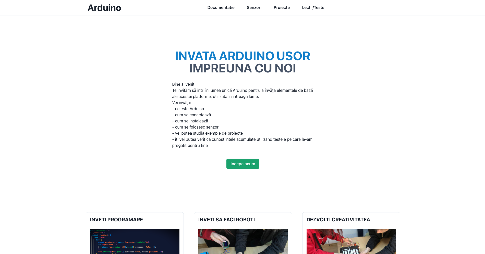
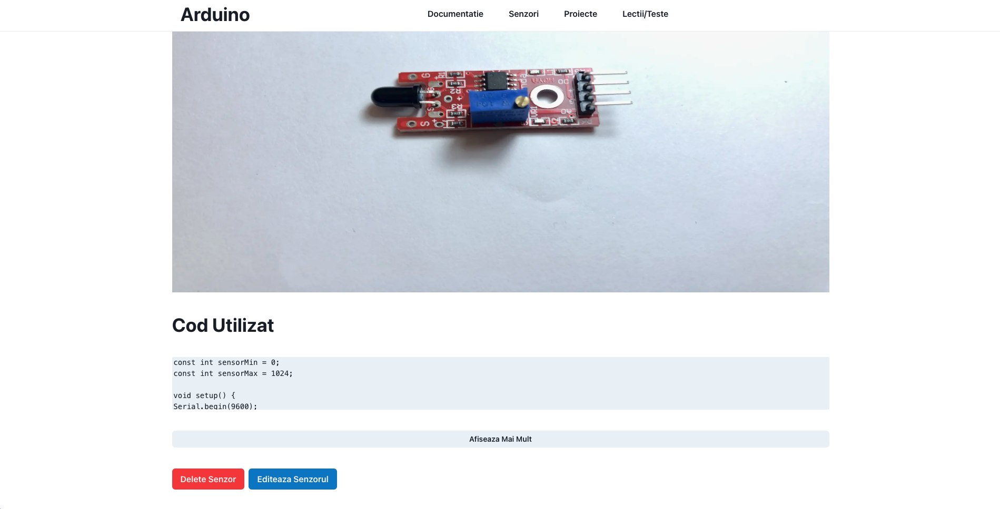

<div align="center">
  <a href="https://github.com/rsh1337/arduino-website">
    
  </a>
    <h3 align="center">Arduino</h3>

  <p align="center">
    Invata Arduino Impreuna Cu Noi!
    <br />
    <a href="https://arduino.rares-andrei.me"><strong>Incepe Acum<strong><a>
  </p>
</div>

## Despre Proiect



Arduino este un soft educational creat cu scopul de a ajuta elevii interesaţi de tehnologie, dar care nu ştiu de unde şi cum să înceapă să înveţe.

Platforma Arduino este foarte versatilă și oferă o mulțime de opțiuni utilizatorilor. Cea mai bună modalitate de a învăța este să încercați câteva proiecte de probă. Proiectele de nivel începător vor permite să vă familiarizați cu platforma și cu limbajul de programare. Aceste idei de proiect ar trebui să furnizeze unele indicii despre ce este capabilă platforma Arduino, necesitând doar o înțelegere de bază a tehnologiei.

### Construit cu

* Libraria de javascript este [React.js](https://reactjs.org/docs/getting-started.html) ajutata de framework-ul [Next.js](https://nextjs.org/docs)
* Libraria de componente se numeste [Chakra-ui](https://chakra-ui.com/getting-started)
* Caruselul pentru poze si videoclipuri a fost creat cu [react-responsive-carousel](https://react-responsive-carousel.js.org)
* Iconitele si imaginele de la 'lectii/teste' au fost create de [Cerbu Ionut](https://www.instagram.com/oshikv_/)
* Imaginele sunt incarcate pe [Imgur](https://imgur.com)
* Testele sunt facute cu ajutorul platformei [Learning Apps](https://learningapps.org)
* Lectiile sunt incarcate pe [Google Docs](https://docs.google.com)
* ODM-ul este [Mongoose](https://mongoosejs.com/docs/guide.html) care se foloseste de baza de date [MongoDB](https://www.mongodb.com)
* Pentru autentificarea si inregistrarea adrministratorilor am folosit [Next-Auth](https://next-auth.js.org/getting-started/example)
* Parolele sunt criptate cu ajutorul lui [Bcryptjs](https://www.npmjs.com/package/bcryptjs)
* Sesiunea generata dupa autentificare este realizata cu ajutorul lui [JsonWebToken(JWT)](http://jwt.io)
* Progresiv webapp-ul(PWA) a fost creat cu [next-pwa](https://www.npmjs.com/package/next-pwa)

## Notiuni De Baza

Pentru a rula aplicatia local aveti nevoie de:
* Windows 7 sau mai mare
* Linux
* macOS 10.15 sau mai mare
* [NodeJS](https://nodejs.org) versiunea minima recomandata 16.16.0
* [NPM](https://www.npmjs.com) versiunea minima recomandata 8.x

Pentru a rula aplicatia online aveti nevoie de:
* Conexiune la internet
* iOS 11 sau mai mare
* iPadOS 13 sau mai mare
* macOS 10.15 sau mai mare
* Windows 7 sau mai mare
* Android 5.0 sau mai mare

## Instalare

1. Descarcam Proiectul
```sh
git clone https://github.com/rsh1337/arduino-website
```
2. Instalam Pachetele NPM
```sh
npm install
```
3. Construim Proiectul
```sh
npm run build
```
4. Pornim Proiectul
```sh
npm run start
```

## Prezentare/Utilizare

Accesam https://arduino.rares-andrei.me sau http://localhost:3000

### Pagina Principala


Pe pagina principala putem continua navigarea folosind:
1. Bara de navigare
2. Butonul verde
3. Apasand pe una din cele 3 imagini de jos

### Documentatie


Pe pagina de documentatie ne este prezentata placa Arduino si un tutorial cum se instaleaza Arduino IDE si driver-ul pentru placile replica de Arduno

In stanga avem un cuprins care ne ajuta sa navigam mai usor prin documentatie printr-un click unde dorim sa ajungem

### Senzori


Pe pagina de senzori ne sunt prezentati toti senzorii din baza de date cu o mica descriere pentru fiecare

### Pagina Senzor


Aceasta pagina prezinta senzorul ales detaliu, cu o descriere mai ampla si un cod sursa cu care poate fi testat.

### Proiecte


Pe pagina de proiecte o sa ne fie prezentate toate proiectele din baza de date cu o mica descriere pentru fiecare

### Pagina Proiect


Aceasta pagina prezinta proiectul ales in detaliu, cu o descriere mai ampla, componentele folosite, ce utilizare are acesta si codul sursa

### Lectii/Teste


Pe pagina de lectii/teste sunt lectiile pe care puteti sa le parcurgeti pentru a invata Arduino si testele care o sa va confirme daca ati invatat bine sau nu

### Pagina de inregistrare a administratorilor


Pe pagina de inregistrare o sa se inregistreze administratorii folosind un cod de invitatie creat de alt administrator

### Pagina de conectare a administratorilor


Pe pagina de conectare o sa se conecteze adrministratorii care au deja un cont creat

### Pagina de administratori


Pe pagina de administratori se pot adauga noi senzori/proiecte/lectii sau sa se genereze invitatii



Cand un administrator ramane conectat pe cont o sa poata sa stearga sau sa editeze fiecare lectie/senzor/proiect intrand pe pagina acestuia


